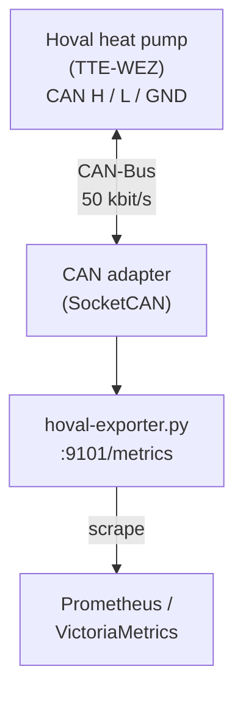
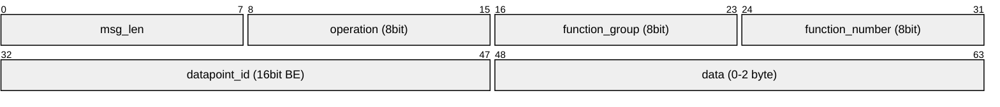

# Hoval CAN-Bus Prometheus Exporter

Reads Hoval heat pump data via CAN-Bus (TopTronic E protocol)
and exposes Prometheus metrics for scraping by VictoriaMetrics, Prometheus, or similar.

Tested with **Hoval Belaria Pro 13** (TTE-WEZ). Should work with other Hoval heat pumps
using the TopTronic E controller family — datapoint IDs may vary.

## Features

- Active polling of 48 datapoints (temperatures, setpoints, status, power, COP, errors)
- Internal COP + SPF from heat pump (no external power meter needed)
- Passive decoding of multi-frame U32 responses (operating hours, thermal energy)
- Own CAN address (`msg_id=6`) to avoid collisions with the Hoval Gateway
- Sentinel value filtering (0x8000 / 0xFFFF = no sensor)
- Prometheus metrics on configurable HTTP port
- YAML configuration with CLI overrides
- Systemd service with hardening (dedicated user, no root)
- Dry-run mode (listen only, no poll requests)

## Architecture



## Quick start

### Prerequisites

- Linux host with SocketCAN interface (Raspberry Pi + CAN HAT, USB-CAN adapter, etc.)
- CAN interface configured at 50 kbit/s
- Python 3.9+

```bash
# Bring up CAN interface
sudo ip link set can0 up type can bitrate 50000

# Install dependencies
python3 -m venv venv
source venv/bin/activate
pip install python-can prometheus-client
pip install pyyaml  # optional, for config.yml support
```

### Run

```bash
# With defaults (can0, port 9101, poll every 30s)
python3 hoval-exporter.py

# Custom config
python3 hoval-exporter.py --config config.yml

# Listen-only mode (no poll requests sent)
python3 hoval-exporter.py --dry-run

# Debug logging
python3 hoval-exporter.py --log-level DEBUG

# Custom metrics port
python3 hoval-exporter.py --port 9200
```

### Verify

```bash
curl -s http://localhost:9101/metrics | grep "^hoval_" | sort
```

### Systemd service

Create a dedicated system user with CAN bus access:

```bash
sudo useradd -r -s /usr/sbin/nologin -d /opt/hoval-exporter hoval
sudo groupadd -r -f can
sudo usermod -aG can hoval

# Allow 'can' group to manage SocketCAN interfaces
echo 'SUBSYSTEM=="net", KERNEL=="can*", GROUP="can", MODE="0660"' | \
    sudo tee /etc/udev/rules.d/90-can.rules
sudo udevadm control --reload-rules
sudo udevadm trigger
```

Install the service:

```bash
# Adjust paths in hoval-exporter.service to match your installation
sudo cp hoval-exporter.service /etc/systemd/system/
sudo systemctl daemon-reload
sudo systemctl enable --now hoval-exporter.service
```

## Configuration

See `config.yml` for all options. CLI args override config file values.

```yaml
can_interface: can0
can_bitrate: 50000
poll_interval: 30       # seconds between poll cycles
poll_delay: 0.1         # seconds between individual requests
metrics_port: 9101

# WEZ addressing — must use gateway device type
wez_device_type: 8      # 0x08 = Gateway device type
wez_device_id: 1        # Device ID (usually 1)
poll_priority: 228      # 0xE4 = Gateway priority
poll_message_id: 6      # msg_id = 6 (Gateway uses 5)
```

## CAN Protocol — Hoval TopTronic E (TTE)

### Arbitration ID (29-bit extended CAN)


Broadcast address: `dev_type=0x0F, dev_id=0xFF` → `0x0FFF`

### Payload format



| Operation | Value  | Direction        |
|-----------|--------|------------------|
| GET       | `0x40` | Request → WEZ    |
| RESPONSE  | `0x42` | WEZ → Broadcast  |
| SET       | `0x46` | Request → WEZ    |

### Data types

| Type | Size   | Signed | Decoding                                      |
|------|--------|--------|-----------------------------------------------|
| U8   | 1 byte | No     | `raw[0]`                                      |
| U16  | 2 byte | No     | `int.from_bytes(raw[:2], 'big')`              |
| S16  | 2 byte | Yes    | `int.from_bytes(raw[:2], 'big', signed=True)` |
| U32  | 4 byte | No     | Multi-frame transport (see below)             |
| LIST | 1 byte | No     | Enum index, see status mappings               |

The `decimal` field specifies implicit scaling: `actual_value = raw_value × 10^(-decimal)`.

Sentinel values: S16 `0x8000` and U16 `0xFFFF` indicate "no sensor" and are filtered.

### Multi-frame transport (U32 datapoints)

U32 datapoints (operating hours, thermal energy) are transmitted as multi-frame
sequences instead of single-frame responses:

```
Start frame  (0x1F400FFF, 8 bytes):
  [flags:1][seq:1][op:1][fg:1][fn:1][dp_hi:1][dp_lo:1][data_0:1]

Continuation (0x1E800FFF, 6 bytes):
  [seq:1][data_1:1][data_2:1][data_3:1][crc_hi:1][crc_lo:1]

U32 value = [data_0, data_1, data_2, data_3] big-endian
```

- `seq` must match between start and continuation frames
- Last 2 bytes of continuation are CRC (ignored by exporter)
- These cannot be polled with single-frame GET; decoded passively

### WEZ addressing

> **Critical:** The TTE-WEZ only responds to GET requests from `dev_type=8`
> (gateway device type). The Hoval 2-TTE R2 Gateway uses `msg_id=5`
> (arb_id `0x05E40801`). This exporter uses `msg_id=6` (arb_id `0x06E40801`)
> to avoid protocol collisions. Requests with `msg_id=0x1F` or `dev_type=1`
> (as used by chrishrb/hoval-gateway for ventilation units) are silently
> ignored by the WEZ.

### Known devices on the bus

| Arb ID pattern | Device                 | Role                       |
|----------------|------------------------|----------------------------|
| `0x05E4_0801`  | Gateway (dev_type=8)   | Polls TTE-WEZ for data     |
| `0x06E4_0801`  | Exporter (dev_type=8)  | Our poll requests           |
| `0x1FC0_0FFF`  | Broadcast              | WEZ single-frame responses  |
| `0x1F40_0FFF`  | Broadcast              | Multi-frame start           |
| `0x1E80_0FFF`  | Broadcast              | Multi-frame continuation    |
| `0x1FE0_0801`  | WEZ internal           | WEZ self-polling            |

## Datapoints

### Temperatures

| Metric name                  | fg  | fn  | dp_id | Type | Dec | Unit | Description                      |
|------------------------------|-----|-----|-------|------|-----|------|----------------------------------|
| `hoval_outdoor_temp_af1`     | 0   | 0   | 0     | S16  | 1   | °C   | Outdoor sensor 1 (AF1)           |
| `hoval_mixed_flow_temp_hc1`  | 1   | 0   | 0     | S16  | 1   | °C   | Mixed flow temperature HC1       |
| `hoval_flow_temp_hc1`        | 1   | 0   | 2     | S16  | 1   | °C   | Flow temperature HC1             |
| `hoval_dhw_temp`              | 2   | 0   | 4     | S16  | 1   | °C   | Domestic hot water temperature   |
| `hoval_dhw_storage_bottom`    | 2   | 0   | 6     | S16  | 1   | °C   | DHW storage bottom sensor        |
| `hoval_return_temp`           | 60  | 254 | 29    | S16  | 1   | °C   | Return temperature               |
| `hoval_return_temp_hp`        | 10  | 1   | 8     | S16  | 1   | °C   | Return temperature heat producer |
| `hoval_flow_temp_hp`          | 10  | 1   | 7     | S16  | 1   | °C   | Flow temperature heat producer   |
| `hoval_hp_temp`               | 60  | 254 | 17    | S16  | 1   | °C   | Heat producer temperature        |
| `hoval_condenser_temp`        | 10  | 1   | 21028 | S16  | 1   | °C   | Condenser temperature            |
| `hoval_evaporator_temp`       | 10  | 1   | 21029 | S16  | 1   | °C   | Evaporator temperature           |
| `hoval_suction_gas_temp`      | 10  | 1   | 21030 | S16  | 1   | °C   | Suction gas temperature          |
| `hoval_evaporator_inlet_temp`   | 60 |254 |    84 | S16  |   1 | °C   | Evaporator inlet / source flow temp       |
| `hoval_evaporator_surface_temp` | 60 |254 |    85 | S16  |   1 | °C   | Evaporator surface / source return temp   |

### Setpoints

| Metric name                          | fg  | fn  | dp_id | Type | Dec | Unit | Description                       |
|--------------------------------------|-----|-----|-------|------|-----|------|-----------------------------------|
| `hoval_room_setpoint_hc1`            | 1   | 0   | 1001  | S16  | 1   | °C   | Room setpoint HC1                 |
| `hoval_room_temp_hc1`                | 1   | 0   | 1     | S16  | 1   | °C   | Room temperature HC1              |
| `hoval_dhw_setpoint`                 | 2   | 0   | 1004  | S16  | 1   | °C   | Hot water setpoint                |
| `hoval_heating_setpoint`             | 60  | 254 | 0     | S16  | 1   | °C   | Heating circuit flow setpoint     |
| `hoval_storage_setpoint`             | 60  | 254 | 1     | S16  | 1   | °C   | Storage tank setpoint             |
| `hoval_flow_setpoint_hc1`            | 1   | 0   | 1002  | S16  | 1   | °C   | Flow setpoint HC1                 |
| `hoval_comfort_room_setpoint_hc1`    | 1   | 0   | 3051  | S16  | 1   | °C   | Comfort room setpoint HC1         |
| `hoval_eco_room_setpoint_hc1`        | 1   | 0   | 3053  | S16  | 1   | °C   | Eco room setpoint HC1             |
| `hoval_cooling_room_setpoint_hc1`    | 1   | 0   | 3054  | S16  | 1   | °C   | Cooling room setpoint HC1         |
| `hoval_flow_setpoint_const_hc1`      | 1   | 0   | 7036  | S16  | 1   | °C   | Flow setpoint constant mode HC1   |
| `hoval_comfort_dhw_setpoint`         | 2   | 0   | 5051  | S16  | 1   | °C   | Comfort hot water setpoint        |
| `hoval_eco_dhw_setpoint`             | 2   | 0   | 5086  | U8   | 0   | °C   | Eco hot water setpoint            |
| `hoval_flow_setpoint_hp`             | 10  | 1   | 1007  | S16  | 1   | °C   | Flow setpoint heat producer       |
| `hoval_fa_flow_setpoint`             | 60  | 254 | 16    | S16  | 1   | °C   | Function automation flow setpoint |

### Power / Efficiency

| Metric name                      | fg | fn | dp_id | Type | Dec | Unit | Description                              |
|----------------------------------|----|----|-------|------|-----|------|------------------------------------------|
| `hoval_modulation`               | 10 |  1 | 20052 | U8   |   0 | %    | Compressor modulation                    |
| `hoval_hp_power_pct`             | 60 |254 |    30 | S16  |   0 | %    | Heat producer power                      |
| `hoval_hp_power_abs_pct`         | 60 |254 |    31 | S16  |   0 | %    | Absolute power                           |
| `hoval_power_limit`              | 60 |254 |     8 | S16  |   1 | %    | Power limit                              |
| `hoval_electrical_power`         | 10 |  1 | 23002 | S16  |   2 | kW   | Electrical power input (HP internal)     |
| `hoval_thermal_power_realtime`   | 10 |  1 | 23003 | S16  |   0 | kW   | Thermal power output (HP internal)       |
| `hoval_cop_internal`             | 60 |254 |    45 | U8   |   1 | -    | Coefficient of performance (COP)         |
| `hoval_spf`                      | 10 |  1 | 23008 | U8   |   1 | -    | Seasonal performance factor (SPF)        |
> **Note:** Pump speeds (`hp_pump_speed`, `main_pump_speed`), `flow_rate`, and `hp_power_setpoint`
> were removed — they consistently return 0 on the Belaria Pro 13.

> **Note on dp 23002/23003:** dp 23002 = electrical power input (decimal=2, kW),
> dp 23003 = thermal power output. Confirmed via TTE-GW-Modbus-datapoints.xlsx.

### Status

| Metric name                  | fg  | fn  | dp_id | Type | Dec | Description                |
|------------------------------|-----|-----|-------|------|-----|----------------------------|
| `hoval_status_hc1`           | 1   | 0   | 2051  | U8   | 0   | Heating circuit 1 status   |
| `hoval_status_dhw`           | 2   | 0   | 2052  | U8   | 0   | Hot water status           |
| `hoval_operating_message`    | 10  | 1   | 20053 | U8   | 0   | Operating message          |
| `hoval_operating_mode_hc1`   | 1   | 0   | 3050  | U8   | 0   | Operating mode HC1         |
| `hoval_operating_mode_dhw`   | 2   | 0   | 5050  | U8   | 0   | Operating mode hot water   |
| `hoval_operating_status_hp`  | 10  | 1   | 20051 | U8   | 0   | Heat producer status       |
| `hoval_fa_status`            | 60  | 254 | 34    | U8   | 0   | Function automation status |
| `hoval_fa_defrost_demand`    | 60  | 254 | 22    | S16  | 1   | Defrost demand / evaporator |
| `hoval_error_hc1`            | 1   | 0   | 500   | U8   | 0   | Error register HC1 (0xFF=ok) |
| `hoval_error_dhw`            | 2   | 0   | 500   | U8   | 0   | Error register DHW (0xFF=ok) |
| `hoval_smartgrid_status`      |  0 |  0 | 21090 | U8   |   0 | Smart Grid status                  |

#### Heating circuit status codes

| Code | Status             | Code | Status             |
|------|--------------------|------|--------------------|
| 0    | Off                | 9    | Normal cooling     |
| 1    | Normal heating     | 12   | Fault              |
| 2    | Comfort heating    | 13   | Manual             |
| 3    | Eco heating        | 22   | Cooling external   |
| 4    | Frost protection   | 23   | Heating external   |
| 5    | Forced consumption | 26   | SmartGrid priority |
| 6    | Forced reduction   |      |                    |
| 7    | Holiday            |      |                    |
| 8    | Party              |      |                    |

#### Hot water status codes

| Code | Status             | Code | Status             |
|------|--------------------|------|--------------------|
| 0    | Off                | 6    | Draw-off           |
| 1    | Normal charging    | 8    | Reduced charging   |
| 2    | Comfort charging   | 12   | SmartGrid priority |
| 5    | Fault              | 13   | SmartGrid forced   |

#### Heat producer status codes (`operating_status_hp`)

Confirmed via CAN-bus capture + [HA community](https://community.home-assistant.io/t/hoval-belaria-integration-gateway/692870)
(jgold mapping, verified by Hoval Product Management):

| Code | Status               | Code | Status                  |
|------|----------------------|------|-------------------------|
|    0 | Off                  |   11 | High pressure fault     |
|    1 | Heating              |   12 | Low pressure fault      |
|    2 | Active cooling       |   16 | Restart delay           |
|    3 | Lock                 |   17 | Energy generator block  |
|    4 | DHW charging         |   18 | Primary lead time       |
|    5 | Frost protection     |   19 | Primary run-on time     |
|    6 | HP temp too low      |   44 | MOP                     |
|    7 | HP flow too high     |   49 | Unsuccessful defrost    |
|    8 | Defrost              |   51 | Condenser pump lead time|
|    9 | Passive cooling      |   55 | Inverter/Modbus fault   |

| Code | Status                   |
|------|--------------------------|
|   72 | Groundwater frost prot.  |
|   73 | Flow rate WQ/GW circuit  |
|   77 | Compressor limitation    |
|   97 | Preheat compressor oil   |
|   98 | Cold start               |
|   99 | Machine not configured   |

**Defrost sequence:** `51` (condenser pump lead) → `8` (defrost active) → `51` (pump run-on) → `1` (back to heating).

#### SmartGrid status codes

| Code | Status                         |
|------|--------------------------------|
|    0 | Normal operation               |
|    1 | Preferred (SG-Ready 3)         |
|    2 | Blocked (SG-Ready 1)           |
|    3 | Forced acceptance (SG-Ready 4) |
|  255 | Inactive / not configured      |

#### Operating mode HC (`operating_mode_hc1`, dp 3050)

Values are sparse (from xlsx Text columns):

| Code | Mode        | Code | Mode        |
|------|-------------|------|-------------|
|    0 | Standby     |    5 | Eco         |
|    1 | Week 1      |    7 | Manual heat |
|    2 | Week 2      |    8 | Manual cool |
|    4 | Constant    |      |             |

#### Operating mode DHW (`operating_mode_dhw`, dp 5050)

| Code | Mode     |
|------|----------|
|    0 | Standby  |
|    1 | Week 1   |
|    2 | Week 2   |
|    4 | Constant |
|    6 | Eco      |

#### Operating message (`operating_message`, dp 20053)

Binary flag: 0 = compressor off, 1 = compressor running.

### Counters

| Metric name                | fg  | fn  | dp_id | Type | Dec | Unit | Description               |
|----------------------------|-----|-----|-------|------|-----|------|---------------------------|
| `hoval_operating_hours`    | 10  | 1   | 2081  | U32  | 0   | h    | Operating hours            |
| `hoval_switching_cycles`   | 10  | 1   | 2080  | U32  | 0   | -    | Switching cycles           |
| `hoval_thermal_power`      | 10  | 1   | 29051 | U32  | 1   | kW   | Current thermal power      |
| `hoval_thermal_energy`     | 10  | 1   | 29050 | U32  | 3   | MWh  | Total thermal energy       |
| `hoval_compressor_starts`  | 10  | 1   | 2053  | U8   | 0   | -    | Compressor start counter   |
| `hoval_electrical_energy_total`    | 10 |  1 | 23009 | U32  |   3 | MWh  | Total electrical energy     |

> **Note:** U32 datapoints are decoded via multi-frame transport (passive only,
> `poll=False`). They cannot be requested with single-frame GET.

### Exporter internals

| Metric name                                      | Type    | Description                        |
|--------------------------------------------------|---------|------------------------------------|
| `hoval_exporter_up`                              | Gauge   | 1 if exporter is running           |
| `hoval_exporter_last_poll_timestamp_seconds`     | Gauge   | Unix timestamp of last poll cycle  |
| `hoval_exporter_last_receive_timestamp_seconds`  | Gauge   | Last decoded CAN response          |
| `hoval_exporter_poll_errors_total`               | Counter | CAN send errors during polling     |
| `hoval_exporter_frames_received_total`           | Counter | All CAN frames received            |
| `hoval_exporter_responses_decoded_total`         | Counter | Successfully decoded TTE responses |
| `hoval_exporter_unknown_datapoints_total`        | Counter | Responses for unknown datapoints   |
| `hoval_exporter_info`                            | Gauge   | Version, interface, interval labels |

## Adding datapoints

Edit the `DEFAULT_DATAPOINTS` list in `hoval-exporter.py`. Each entry needs:

```python
DatapointDef(
    name="my_metric",           # Prometheus metric name (prefixed with hoval_)
    function_group=10,          # fg from datapoints.csv
    function_number=1,          # fn from datapoints.csv
    datapoint_id=20052,         # dp_id from datapoints.csv
    dtype="U8",                 # S16, U8, U16, U32, LIST
    decimal=0,                  # Implicit decimal places
    unit="percent",             # For Prometheus help text
    description="My metric",   # For Prometheus help text
    poll=True,                  # False for U32 (multi-frame only)
)
```

Datapoint IDs can be found in the
[hoval-gateway datapoints.csv](https://github.com/chrishrb/hoval-gateway/blob/main/docs/datapoints.csv).
Filter for your device type (WEZ, Lüftung, etc.).

Datapoint IDs can also be found in the
[official Hoval TTE-GW-Modbus-datapoints.xlsx](http://www.hoval.com/misc/TTE/TTE-GW-Modbus-datapoints.xlsx).

> **Note on dp_id ambiguity:** Some datapoint IDs map to different metrics
> depending on the function group context. For example, dp 22 in `Automat`
> context = "Heizung Sollwert" (S16, °C) but in `Wärmeerz.` context =
> "Drehzahl Hauptpumpe" (U8, %). The fg/fn combination resolves this.

## Grafana Dashboard

A pre-built dashboard is included: `hoval-heatpump-v1.json`

Import in Grafana: **Dashboards → Import → Upload JSON file**, then select
your Prometheus/VictoriaMetrics datasource when prompted.

The dashboard includes:

- **Overview** — stat panels for temperatures, power, status, COP, SPF, energy totals, and exporter health
- **Temperature Curves** — heating circuit and DHW temps with setpoints (dashed)
- **Temperature Delta & Efficiency** — flow-return delta (heat transfer indicator), realtime thermal/electrical ratio, COP and SPF trends
- **Heat Producer Detail** — condenser, evaporator, suction gas temps + modulation
- **Power & Efficiency** — electrical/thermal power, COP, SPF, modulation
- **Outdoor Unit** — defrost demand with defrost-active indicator, evaporator inlet/surface temps
- **Operating Status** — status codes, operating modes (state timeline), error registers
- **Setpoints** — all configurable setpoints in one view
- **Counters** — operating hours, switching cycles, thermal/electrical energy, COP/SPF trends
- **Exporter Health** — frame rates and staleness (collapsed)

> **Note:** HC2/HC3/AF2 datapoints have been removed (not physically connected on single-circuit Belaria Pro 13).
> If your system has multiple heating circuits, re-add them to `DEFAULT_DATAPOINTS`.

## Troubleshooting

### No data in metrics

1. Check CAN interface: `ip link show can0` → should be UP
2. Check frames: `candump can0` → should show traffic
3. Check exporter logs: `journalctl -u hoval-exporter -n 50`
4. Check metrics: `curl localhost:9101/metrics | grep hoval_exporter_frames`
   - `frames_received_total` increasing? → CAN works, check datapoint matching
   - `frames_received_total` = 0? → CAN wiring issue
   - `unknown_datapoints_total` high? → WEZ sending DPs not in registry

### Plausibility check

| Metric                      | Expected range | Notes                  |
|-----------------------------|----------------|------------------------|
| `hoval_outdoor_temp_af1`    | -20 to +40 °C  | Depends on season      |
| `hoval_flow_temp_hc1`       | 25 to 55 °C    | Higher in cold weather |
| `hoval_dhw_temp`             | 35 to 60 °C    | ~42°C typical          |
| `hoval_return_temp*`         | 20 to 45 °C    | Always < flow temp     |
| `hoval_modulation`           | 0 to 100 %     | 0 when idle            |
| `hoval_condenser_temp`       | 25 to 60 °C    | > return temp when running |
| `hoval_electrical_power`    | 0 to 4 kW      | 0 when idle, ~1-3.5 kW typical |
| `hoval_cop_internal`        | 0 to 8         | 3-5 typical for air-source HP  |
| `hoval_spf`                 | 0 to 8         | 3.5-5.0 seasonal average       |

### CAN bus errors

If `poll_errors_total` increases:
- CAN bus overloaded → increase `poll_delay`
- Wiring issue → check H/L not swapped, GND connected
- Termination mismatch → check adapter termination resistor setting

## References

- [Hoval TTE-GW-Modbus-datapoints.xlsx](http://www.hoval.com/misc/TTE/TTE-GW-Modbus-datapoints.xlsx) — Official Modbus datapoint reference
- [HA Community: Hoval Belaria Integration](https://community.home-assistant.io/t/hoval-belaria-integration-gateway/692870) — Status code mappings and Modbus TCP configs
- [chrishrb/hoval-gateway](https://github.com/chrishrb/hoval-gateway) — Hoval TTE protocol reference and datapoints CSV
- [Hoval TopTronic E documentation](https://www.hoval.com) — Controller manuals (installer access required)

## License

MIT
